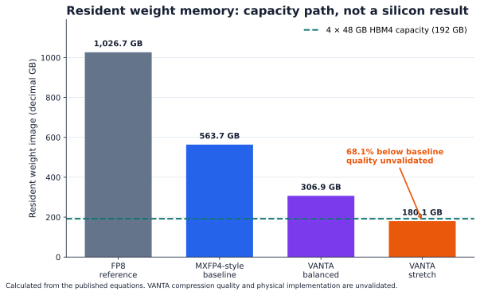
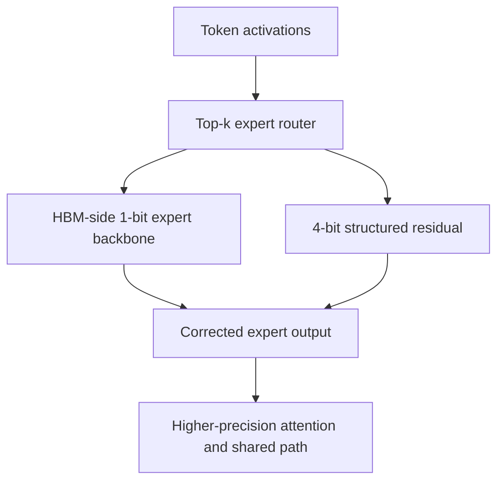
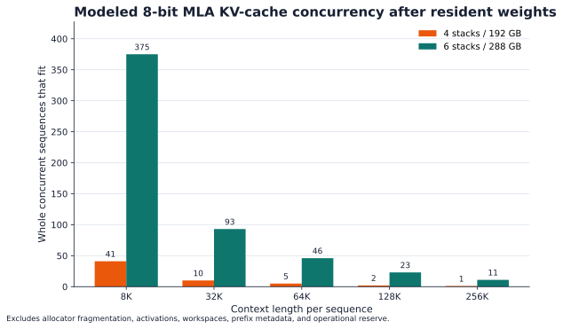
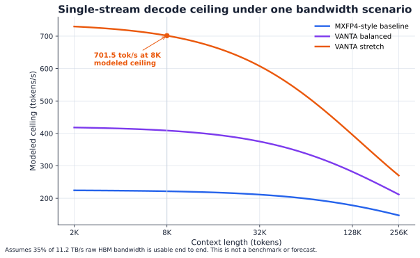

# VANTA-1T

**An open, falsifiable accelerator study for fitting a 1T-total / 32B-active MoE in one package.**

[](./tests)
[](./PROJECT_STATUS.md)
[](./LICENSE)
[](./paper/LICENSE-CC-BY-4.0.md)

VANTA-1T stands for **Variable-precision Activation-routed Near-memory Tile Accelerator**. It explores one deliberately aggressive question:

> Can a trillion-parameter sparse mixture-of-experts model be made resident in one accelerator package with more than 50% less weight memory than a transparent MXFP4-style baseline?

The executable model says **yes on capacity, conditionally**: the stretch profile calculates **180.1 GB** of resident weights versus **563.7 GB**, a **68.1% reduction**. The condition is enormous: the proposed 1-bit backbone plus structured 4-bit residual has **not** been shown to preserve model quality.

> [!IMPORTANT]
> This repository contains an analytical architecture proposal, not fabricated silicon. Capacity and bandwidth ceilings are calculated. Accuracy, power, physical area, timing, thermals, yield, cost, and end-to-end performance are unvalidated.



## Read this first

| Question | Current answer |
| --- | --- |
| Does the modeled weight image fit four 48 GB HBM4 stacks? | **Yes**, with 11.7 GB left at 8K context / one sequence. |
| Is it 68.1% smaller than the stated MXFP4-style baseline? | **Yes**, analytically. |
| Is the physical package 68.1% smaller? | **Unknown.** No area claim is made. |
| Is it as fast as Jalapeño or Rubin? | **Unknown.** The 701.5 tok/s figure is a bandwidth ceiling, not a benchmark. |
| Does the compressed 1T model retain quality? | **Unknown. This is the first gating experiment.** |
| Can I inspect and reproduce every headline number? | **Yes.** Run the commands below. |

## The idea



VANTA routes tokens before moving expert work. A proposed near-memory binary engine handles the one-bit expert backbone beside HBM. Compute chiplets apply a small structured residual and retain attention, routing, embeddings, the shared expert, and the dense layer at higher precision. The package changes scheduling between prefill and decode while keeping hot model and KV state local.

## Headline results

| Metric | Result | Evidence |
| --- | ---: | --- |
| MXFP4-style resident weights | 563.74 GB | Calculated baseline |
| VANTA stretch resident weights | 180.06 GB | Calculated hypothesis |
| Reduction | **68.06%** | Calculated hypothesis |
| Four-stack HBM4 capacity | 192 GB | Public component capacity assumption |
| 8K / one-sequence headroom | 11.66 GB | Calculated, excludes runtime reserve |
| 8K batch-1 decode ceiling | 701.5 tok/s | First-order bandwidth model |
| Compression quality | Unknown | Must be measured |
| Physical chip/package size | Unknown | Requires PDK-backed work |





## Reproduce it

Requires Python 3.10 or newer.

```bash
python3 -m venv .venv
source .venv/bin/activate
python3 -m pip install -r requirements.txt
make all
```

Without `make`:

```bash
python3 model/vanta_model.py --output-dir model/output --print
python3 figures/generate_figures.py
python3 -m unittest discover -s tests -v
```

The commands regenerate `results.json`, `sweep.csv`, all figures, and the six analytical checks. They do not download model weights or require a GPU.

## Explore the architecture

Open [`vanta-1t-lab.html`](./vanta-1t-lab.html) locally for the standalone interactive lab. It lets you switch precision profiles, change context and concurrency, and trace one token through the proposed architecture.

## Repository map

| Path | What it contains |
| --- | --- |
| [`model/`](./model) | Capacity, KV-cache, and bandwidth equations plus generated data |
| [`figures/`](./figures) | Reproducible graph code and publication-ready SVG/PNG figures |
| [`tests/`](./tests) | Analytical invariants and claim-boundary checks |
| [`rtl/`](./rtl) | Pedagogical SystemVerilog router and binary-residual MAC |
| [`paper/`](./paper) | Preprint source and rendering script |
| [`output/pdf/`](./output/pdf) | Rendered preprint |
| [`SPEC.md`](./SPEC.md) | Architecture and validation specification |
| [`CLAIMS.md`](./CLAIMS.md) | What may and may not be claimed publicly |
| [`vanta-1t-lab.html`](./vanta-1t-lab.html) | Standalone interactive lab |

## What would falsify VANTA-1T?

The project fails its central claim if a properly trained or distilled open MoE proxy cannot retain useful quality near the proposed **1.325 effective bits per routed-expert weight**. It can also fail at package feasibility, routing imbalance, thermal density, signal integrity, compiler scheduling, or end-to-end service efficiency.

The immediate next experiment is therefore not a prettier floorplan. It is a quality-versus-effective-bits curve on a smaller open MoE, compared with BF16, INT4, and MXFP4.

## Sources and comparison boundary

- [Moonshot AI's Kimi K2.5 configuration](https://github.com/MoonshotAI/Kimi-K2.5) supplies the 1T-total / 32B-active workload parameters.
- [OpenAI's Jalapeño results](https://openai.com/index/jalapeno-first-results/) motivate locality, integrated networking, and phase-aware scheduling. No affiliation or equivalence is implied.
- [NVIDIA's preliminary Rubin specifications](https://www.nvidia.com/en-us/data-center/vera-rubin-nvl72/) provide public context, not a measured VANTA baseline.
- [Micron's HBM4 information](https://www.micron.com/products/memory/hbm/hbm4) supports the conservative 48 GB / 2.8 TB/s-per-stack assumption.

## Authorship

**Mahee Monjur**, Independent Researcher, is the project author and accepts responsibility for its claims. OpenAI models assisted with literature discovery, architecture exploration, implementation, checking, visualization, and drafting; AI systems are not authors.

## License

Code is MIT licensed. The paper and figures are CC BY 4.0. See [`LICENSE`](./LICENSE) and [`paper/LICENSE-CC-BY-4.0.md`](./paper/LICENSE-CC-BY-4.0.md).
